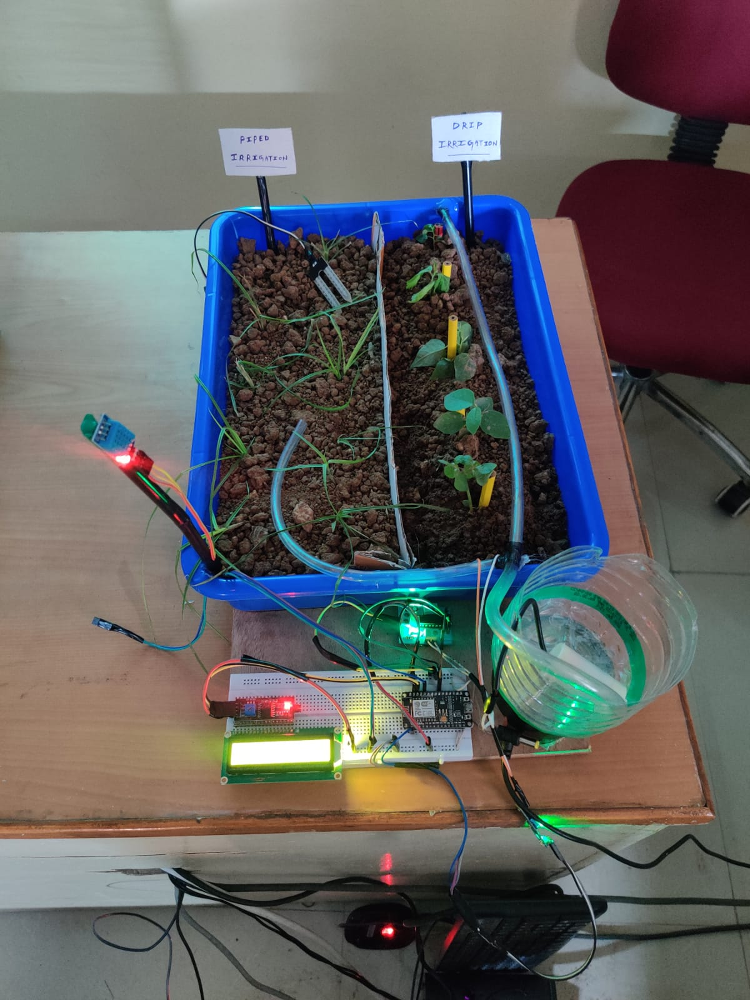

# 🌾 **Krishi-Suvidha**: Automated Smart Irrigation System 🚜💧

**Krishi-Suvidha** is an IoT-driven, AI-powered **Automated Irrigation System** designed to revolutionize water management in agriculture. By utilizing **soil moisture sensors**, **AI-based monitoring**, **real-time weather data**, and **IoT integration** with the **Blynk app**, Krishi-Suvidha ensures efficient and optimized water usage for farmers, reducing wastage and improving crop yields.

📱 The **Krishi-Suvidha Mobile App** allows farmers to monitor and control irrigation remotely, with real-time updates, predictive insights, and **Blynk-powered analytics** on their crops.

---

## 🚀 **Project Overview**

**Krishi-Suvidha** consists of both **hardware** and **software** components that work together seamlessly to optimize irrigation:

### **Hardware:**
- **Soil Moisture Sensors**: Detect moisture levels at the crop's root zone.
- **Automated Solenoid Valves**: Control water flow based on moisture levels.
- **Weather Monitoring System**: Real-time data for accurate irrigation scheduling.
- **LED Screen Display**: Displays real-time sensor data and irrigation status.
- **Blynk IoT Integration**: Real-time analytics and remote monitoring via the **Blynk IoT app**.

### **Software:**
- **Flutter App**: Cross-platform app for monitoring and controlling the system.
- **Firebase Integration**: (Coming Soon) For real-time updates, authentication, and cloud storage.

---

## 🌟 **Key Features**

- 🌱 **Soil Moisture Monitoring**: Custom-built sensors for real-time root zone moisture data.
- 💧 **Automated Irrigation**: Regulate water flow based on moisture and weather conditions.
- 🌍 **Real-Time Weather Integration**: Ensure irrigation schedules match current weather conditions.
- 📱 **Mobile App**: Built using Flutter, with a user-friendly interface for farmers to control the system remotely.
- 🏛️ **Government Schemes Information**: Farmers can access real-time updates on agricultural schemes.
- 📊 **Blynk IoT Analytics**: Real-time sensor data analytics via the **Blynk app**, allowing farmers to monitor system performance remotely.
- 💡 **LED Screen Display**: Visual display of sensor data and irrigation system status.

---

## 🎯 **Use Cases**

### **Farmer Use Case**
- 🚜 **Easy Installation**: Quick setup for farmers with minimal technical knowledge.
- 💧 **Flexible Control**: Schedule irrigation manually or let the system handle it automatically.
- 📱 **Offline Support**: Access key features even in areas with limited internet.
- 🎓 **Educational Resources**: Information on farming best practices, crop management, and government schemes.
- 📊 **Real-Time Analytics**: View system status, soil moisture levels, and other metrics on the **Blynk app**.

### **Government Use Case**
- 📊 **Crop Record Transparency**: Easily track and manage agricultural records.
- 🌾 **Support for Farmers**: Promote automated irrigation technology and schemes.
- 💻 **Centralized Platform**: All farmers connected under one roof.

---

## 🧰 **Technologies Used**

  - 🖥️ Flutter: For building the cross-platform mobile app.
  - 🌐 Firebase: For real-time data storage and user authentication (coming soon).
  - 🤖 Machine Learning: For plant growth monitoring and disease detection.
  - 💻 Dart: Programming language for building the Flutter app.
  - 💧 IoT: Custom soil moisture sensors and solenoid valves for automation.
  - 🌩️ API Integration: Real-time weather monitoring.

### 📸 **Screenshots**

💬 Acknowledgements

    The Krishi-Suvidha team: Hrishabh Agrawal, Saumya Vidyarthi, Mahima Sachdeva, Siddhant Tiwari, Keyur Ganorkar, and Nayan Kumar.
    Special thanks to all contributors, and everyone who made this project possible.
